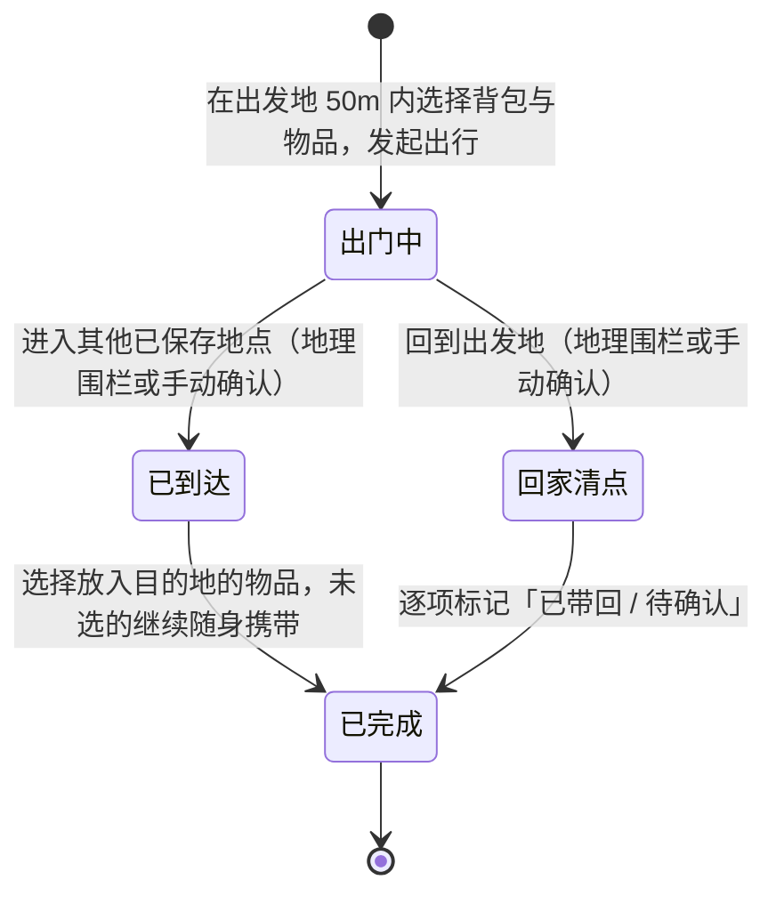

# Gowith

**带上要带的，记住带回的。**

Gowith 是一款纯本地、零依赖的 iOS 出行物品管理 App。它记录的不是待办事项，而是一件真实物品的空间旅程：从某个家出发、跟着你移动、在另一个地点被放下、最后被确认带回。

   

## 它解决什么问题

- 出门忘带关键物品（钥匙、充电器、相机卡）
- 物品放在外地（健身房、办公室）之后忘记带回
- 带出去的东西回家后，不确定是否都带回来了

## 核心概念

Gowith 的世界由一条对象关系链构成：

```
地点 → 背包 → 物品 → 出行会话 → 新地点 → 回家清点
```

- **地点（Place）**：地图上标记的物理位置（家、公司、健身房……），默认带约 50 米的地理围栏
- **背包（Backpack）**：装物品的容器，出行以背包为单位发起
- **物品（Item）**：归属于某个地点，可分类、可拍照或选图作为图标
- **出行会话（Outing Session）**：一次出门的完整记录，物品以快照形式进入会话，历史不受后续编辑影响

## 功能特性

### 🎒 背包
- 横向轮播选择背包，前后对象缩小模糊露出边缘，形成空间层级
- 内置 8 个纯 SwiftUI 绘制的伪 3D 图标，也可用 SF Symbols 或相册照片自定义
- 查看已装物品清单，一键增删

### 🗃 物品库
- 按地点 + 分类管理物品，支持自定义分类
- 相机拍照或从相册选图作为物品图标（图片本地存储并做内存缓存）
- 就地装包、发起出行

### 🗺 地图与地点
- 地图查看所有已保存地点与当前位置
- 新建地点支持「使用当前位置」与「地图点选」双通道
- 到达地点范围约 50 米内才允许拿取或调整该地点的物品（防止远程误操作）

### 🚶 出行会话（产品的灵魂）



- 发起出行要求你真实位于出发地围栏内，清单一旦开始即固化快照
- 出门期间在后台监测离开出发地与到达其他地点，进入围栏时发送本地通知提醒确认
- 到达其他地点时，可选择哪些物品存放在那里（物品与背包会归属到新地点）
- 回家清点逐项确认「已带回 / 待确认」；未确认物品保留 **3 天**宽限期，到期自动标记为遗失，并在首屏提示
- 「我的」页提供出行统计、历史记录与每次会话的完整详情

## 技术实现

| 模块 | 方案 |
| --- | --- |
| UI | SwiftUI（iOS 17+，iPhone / iPad，竖屏） |
| 地图 | MapKit（SwiftUI `Map` / `Marker` / `MapCircle`） |
| 定位与围栏 | CoreLocation（`CLCircularRegion` 区域监测，出发地 exit + 目的地 entry） |
| 通知 | UserNotifications（到达提醒本地通知） |
| 媒体 | PhotosUI 相册选图 + 相机拍摄 |
| 持久化 | 本地 JSON（手写 Codable）+ 文件系统图片存储 + NSCache 内存缓存 |
| 架构 | 单一数据仓 `GowithStore`（ObservableObject）+ EnvironmentObject 注入 |

其他实现细节：

- **零第三方依赖**：不使用任何外部库、无后端、无网络请求
- **伪 3D 图标**：多层 SF Symbol 叠加渐变与高光，纯 SwiftUI 绘制（`Gowith3DIcon`）
- **自建设计系统**：色彩（自动适配深色模式）、间距、动效曲线、触感反馈集中在 `DesignSystem.swift`，约 20 个通用组件复用全 App
- **可访问性**：状态永远「图标 + 文字」双通道表达，全量中文 VoiceOver 标签，触控目标 ≥ 44pt，支持动态字体与 Reduce Motion 降级

## 项目结构

```
Gowith/
├── Gowith.xcodeproj
└── Gowith/
    ├── GowithApp.swift        # App 入口与全局外观配置
    ├── RootView.swift         # 启动流程（Hero/引导）、主导航、背包页
    ├── Models.swift           # 数据模型、GowithStore 持久化、本地图片存储
    ├── LocationService.swift  # 定位授权、地理围栏监测、到达通知
    ├── GoView.swift           # 出行会话全流程界面（出门/到达/清点）
    ├── ItemViews.swift        # 物品库、分类与物品编辑器
    ├── PlaceViews.swift       # 地点地图与地点编辑器
    ├── ProfileViews.swift     # 我的、历史记录与会话详情
    ├── DesignSystem.swift     # 设计系统：色彩、动效、触感与通用组件
    └── Gowith3DIcon.swift     # 纯 SwiftUI 伪 3D 图标
```

## 快速开始

**环境要求**：Xcode 15+（含 iOS 17 SDK），运行目标为 iOS 17.0 及以上。

```bash
git clone https://github.com/wayne0612/Gowith.git
cd Gowith
open Gowith/Gowith.xcodeproj
```

在 Xcode 中选择目标设备后 `Cmd + R` 运行即可，无需安装任何依赖。

> 💡 首次启动会进入引导流程：命名你的第一个「家」、创建第一个背包、添加第一件物品。
> 地理围栏的后台到达提醒需要授予「始终定位」权限；模拟器可通过 **Features → Location** 模拟移动来体验围栏触发。

## 隐私与数据

- **全部数据只存在本机**：结构化数据保存在 `Application Support/gowith-data.json`，图片保存在 `Application Support/GowithImages/`
- 无网络请求、无账号体系、无分析 SDK，删除 App 即删除全部数据
- 出行会话记录的是物品快照（名称/图标），历史记录不随后续编辑变化

## 系统权限说明

| 权限 | 何时请求 | 用途 |
| --- | --- | --- |
| 定位（使用期间） | 引导设置 / 设置地点 | 获取当前位置、判断是否在地点围栏内 |
| 定位（始终） | 发起出行时 | 在后台监测离开出发地与到达目的地，触发提醒 |
| 通知 | 发起出行时 | 到达地点的本地提醒（可在设置中关闭） |
| 相机 / 相册 | 编辑物品或背包图标时 | 拍摄或选择图片 |

## 项目文档

- [Gowith 产品原型报告](Gowith-产品原型报告.md) —— 完整 PRD：信息架构、状态机、页面与数据模型
- [Gowith 设计系统规范](Gowith-Design-System.md) —— 唯一生效的设计规范 v2.0
- [UI System](UI-system.md) / [UIUX Motion Design](uiuxmotion-design.md) —— 视觉与动效设计过程稿

## 版本

- **v1.0.0**（当前）—— 纯本地 MVP：地点 / 背包 / 物品库 / 出行会话状态机 / 地理围栏提醒 / 历史记录

后续方向（详见产品原型报告）：真机围栏回归、GowithStore 单元测试、Widget 快捷入口、多背包出行、云端同步。
